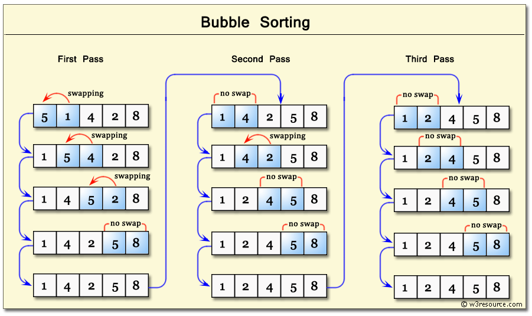

# Sorting

### Selection Sort

<figure><figcaption><p>selection sort </p></figcaption></figure>

```java
class Solution {
    void sort(int arr[]) {
        int n = arr.length;

        // One by one move boundary of unsorted subarray
        for (int i = 0; i < n - 1; i++) {
            // Find the minimum element in unsorted array
            int min_idx = i;
            for (int j = i + 1; j < n; j++)
                if (arr[j] < arr[min_idx])
                    min_idx = j;

            // Swap the found minimum element with the first
            // element
            int temp = arr[min_idx];
            arr[min_idx] = arr[i];
            arr[i] = temp;
        }
    }

    // Prints the array
    void printArray(int arr[]) {
        int n = arr.length;
        for (int i = 0; i < n; ++i)
            System.out.print(arr[i] + " ");
        System.out.println();
    }

    // Driver code to test above
    public static void main(String[] args) {
        Solution ob = new Solution();
        int arr[] = { 64, 25, 12, 22, 11 };
        ob.sort(arr);
        System.out.println("Sorted array");
        ob.printArray(arr);
    }
}
```

#### C programming

```c
#include <stdio.h>
#include <stdlib.h>

int main() {

  int N = 20;
  int arr[N];

  for(int i=0; i<N; i++) {
    arr[i] = rand()%100;
  }

  for(int i = 0; i<N; i++) {
    printf("%d ", arr[i]);
  }

  printf("\n");

  for(int i=0; i<N-1; i++) {
    int minindex = i;

    for(int j=i+1; j<N; j++) {
      if(arr[j]<arr[minindex]) {
        minindex = j;
      }
    }

    int temp = arr[minindex];
    arr[minindex] = arr[i];
    arr[i] = temp;
    
  }

    for(int i = 0; i<N; i++) {
    printf("%d ", arr[i]);
  }

  printf("\n");
  
  
}
```

### Insertion Sort

<figure><figcaption></figcaption></figure>

```java
class Solution {
    static void sort(int arr[]) {
        int n = arr.length;
        for (int i = 1; i < n; ++i) {
            int key = arr[i];
            int j = i - 1;
            while (j >= 0 && arr[j] > key) {
                arr[j + 1] = arr[j];
                j = j - 1;
            }
            arr[j + 1] = key;
            arr_printer(arr);
        }
    }

    static void arr_printer(int[] arr) {
        for (int key : arr) {
            System.out.print(key + " ");
        }
        System.out.print("\n");
    }

    static void printArray(int arr[]) {
        int n = arr.length;
        for (int i = 0; i < n; ++i)
            System.out.print(arr[i] + " ");
        System.out.println();
    }

    public static void main(String[] args) {
        int arr[] = { 13, 12, 11, 10, 6, 5 };
        sort(arr);
        printArray(arr);
    }
}
```


### Quick Sort

```java
class Solution {
    int partition(int arr[], int low, int high) {
        int pivot = arr[high];
        // index of smaller element
        int i = (low - 1);
        for (int j = low; j < high; j++) {
            // If current element is smaller than the pivot
            if (arr[j] < pivot) {
                i++;
                int temp = arr[i];
                arr[i] = arr[j];
                arr[j] = temp;
            }
        }
        // swap arr[i+1] and arr[high] (or pivot)
        int temp = arr[i + 1];
        arr[i + 1] = arr[high];
        arr[high] = temp;
        return i + 1;
    }

    void sort(int arr[], int low, int high) {
        if (low < high) {
            int pi = partition(arr, low, high);
            sort(arr, low, pi - 1);
            sort(arr, pi + 1, high);
        }
    }

    static void printArray(int arr[]) {
        int n = arr.length;
        for (int i = 0; i < n; ++i)
            System.out.print(arr[i] + " ");
        System.out.println();
    }

    // Driver program
    public static void main(String[] args) {
        int arr[] = { 10, 7, 8, 9, 1, 5 };
        int n = arr.length;
        Solution ob = new Solution();
        ob.sort(arr, 0, n - 1);
        System.out.println("sorted array");
        printArray(arr);
    }
}
```

### Merge Sort

```java
class Solution {
    void merge(int arr[], int l, int m, int r) {
        // Find sizes of two subarrays to be merged
        int n1 = m - l + 1;
        int n2 = r - m;
        /* Create temp arrays */
        int L[] = new int[n1];
        int R[] = new int[n2];
        /* Copy data to temp arrays */
        for (int i = 0; i < n1; ++i)
            L[i] = arr[l + i];
        for (int j = 0; j < n2; ++j)
            R[j] = arr[m + 1 + j];
        /* Merge the temp arrays */
        // Initial indexes of first and second subarrays
        int i = 0, j = 0;
        // Initial index of merged subarry array
        int k = l;
        while (i < n1 && j < n2) {
            if (L[i] <= R[j]) {
                arr[k] = L[i];
                i++;
            } else {
                arr[k] = R[j];
                j++;
            }
            k++;
        }
        /* Copy remaining elements of L[] if any */
        while (i < n1) {
            arr[k] = L[i];
            i++;
            k++;
        }
        /* Copy remaining elements of R[] if any */
        while (j < n2) {
            arr[k] = R[j];
            j++;
            k++;
        }
    }

    // Main function that sorts arr[l..r] using
    // merge()
    void sort(int arr[], int l, int r) {
        if (l < r) {
            // Find the middle point
            int m = (l + r) / 2;
            // Sort first and second halves
            sort(arr, l, m);
            sort(arr, m + 1, r);
            // Merge the sorted halves
            merge(arr, l, m, r);
        }
    }

    /* A utility function to print array of size n */
    static void printArray(int arr[]) {
        int n = arr.length;
        for (int i = 0; i < n; ++i)
            System.out.print(arr[i] + " ");
        System.out.println();
    }

    // Driver code
    public static void main(String[] args) {
        int arr[] = { 12, 11, 13, 5, 6, 7 };
        System.out.println("Given Array");
        printArray(arr);
        Solution ob = new Solution();
        ob.sort(arr, 0, arr.length - 1);
        System.out.println("\nSorted array");
        printArray(arr);
    }
}
```

### Bubble Sort

<figure><figcaption></figcaption></figure>

```java
class Solution {
    void bubbleSort(int arr[]) {
        int n = arr.length;
        for (int i = 0; i < n - 1; i++)
            for (int j = 0; j < n - i - 1; j++)
                if (arr[j] > arr[j + 1]) {
                    // swap arr[j+1] and arr[j]
                    int temp = arr[j];
                    arr[j] = arr[j + 1];
                    arr[j + 1] = temp;
                }
    }

    /* Prints the array */
    void printArray(int arr[]) {
        int n = arr.length;
        for (int i = 0; i < n; ++i)
            System.out.print(arr[i] + " ");
        System.out.println();
    }

    // Driver method to test above
    public static void main(String[] args) {
        Solution ob = new Solution();
        int arr[] = { 64, 34, 25, 12, 22, 11, 90 };
        ob.bubbleSort(arr);
        System.out.println("Sorted array");
        ob.printArray(arr);
    }
}
```

#### C Programming

```c
#include <stdio.h>
#include <stdlib.h>

int main() {

  int N = 20;
  int arr[N];

  for (int i = 0; i < N; i++) {
    arr[i] = rand() % 100;
    printf("%d ", arr[i]);
  }

  printf("\n");

  for (int i = 0; i < N - 1; i++) {
    for (int j = 0; j < N - i - 1; j++) {
      if (arr[j] > arr[j + 1]) {
        int temp = arr[j + 1];
        arr[j + 1] = arr[j];
        arr[j] = temp;
      }
    }
  }

  for (int i = 0; i < N; i++) {
    printf("%d ", arr[i]);
  }
}
```

### Radix Sort

```java
import java.util.*;

class Solution {
    static int getMax(int arr[], int n) {
        int mx = arr[0];
        for (int i = 1; i < n; i++)
            if (arr[i] > mx)
                mx = arr[i];
        return mx;
    }

    // A function to do counting sort of arr[] according to
    // the digit represented by exp.
    static void countSort(int arr[], int n, int exp) {
        int output[] = new int[n]; // output array
        int i;
        int count[] = new int[10];
        Arrays.fill(count, 0);
        // Store count of occurrences in count[]
        for (i = 0; i < n; i++)
            count[(arr[i] / exp) % 10]++;
        // Change count[i] so that count[i] now contains
        // actual position of this digit in output[]
        for (i = 1; i < 10; i++)
            count[i] += count[i - 1];
        // Build the output array
        for (i = n - 1; i >= 0; i--) {
            output[count[(arr[i] / exp) % 10] - 1] = arr[i];
            count[(arr[i] / exp) % 10]--;
        }
        // Copy the output array to arr[], so that arr[] now
        // contains sorted numbers according to curent digit
        for (i = 0; i < n; i++)
            arr[i] = output[i];
    }

    // The main function to that sorts arr[] of size n using
    // Radix Sort
    static void radixsort(int arr[], int n) {
        // Find the maximum number to know number of digits
        int m = getMax(arr, n);
        // Do counting sort for every digit. Note that
        // instead of passing digit number, exp is passed.
        // exp is 10^i where i is current digit number
        for (int exp = 1; m / exp > 0; exp *= 10)
            countSort(arr, n, exp);
    }

    // A utility function to print an array
    static void print(int arr[], int n) {
        for (int i = 0; i < n; i++)
            System.out.print(arr[i] + " ");
    }

    /* Driver Code */
    public static void main(String[] args) {
        int arr[] = { 170, 45, 75, 90, 802, 24, 2, 66 };
        int n = arr.length;
        // Function Call
        radixsort(arr, n);
        print(arr, n);
    }
}
```

### Bucket Sort

```java
import java.util.*;
import java.util.Collections;

class Solution {

    // Function to sort arr[] of size n
    // using bucket sort
    static void bucketSort(float arr[], int n) {
        if (n <= 0)
            return;

        // 1) Create n empty buckets
        @SuppressWarnings("unchecked")
        Vector<Float>[] buckets = new Vector[n];

        for (int i = 0; i < n; i++) {
            buckets[i] = new Vector<Float>();
        }

        // 2) Put array elements in different buckets
        for (int i = 0; i < n; i++) {
            float idx = arr[i] * n;
            buckets[(int) idx].add(arr[i]);
        }

        // 3) Sort individual buckets
        for (int i = 0; i < n; i++) {
            Collections.sort(buckets[i]);
        }

        // 4) Concatenate all buckets into arr[]
        int index = 0;
        for (int i = 0; i < n; i++) {
            for (int j = 0; j < buckets[i].size(); j++) {
                arr[index++] = buckets[i].get(j);
            }
        }
    }

    // Driver code
    public static void main(String args[]) {
        float arr[] = { (float) 0.897, (float) 0.565,
                (float) 0.656, (float) 0.1234,
                (float) 0.665, (float) 0.3434 };

        int n = arr.length;
        bucketSort(arr, n);

        System.out.println("Sorted array is ");
        for (float el : arr) {
            System.out.print(el + " ");
        }
    }
}

```

### Heap Sort

```python
class Solution {
    public void sort(int arr[]) {
        int n = arr.length;
        // Build heap (rearrange array)
        for (int i = n / 2 - 1; i >= 0; i--)
            heapify(arr, n, i);
        // One by one extract an element from heap
        for (int i = n - 1; i > 0; i--) {
            // Move current root to end
            int temp = arr[0];
            arr[0] = arr[i];
            arr[i] = temp;
            // call max heapify on the reduced heap
            heapify(arr, i, 0);
        }
    }

    // To heapify a subtree rooted with node i which is
    // an index in arr[]. n is size of heap
    void heapify(int arr[], int n, int i) {
        int largest = i; // Initialize largest as root
        int l = 2 * i + 1; // left = 2*i + 1
        int r = 2 * i + 2; // right = 2*i + 2
        // If left child is larger than root
        if (l < n && arr[l] > arr[largest])
            largest = l;
        // If right child is larger than largest so far
        if (r < n && arr[r] > arr[largest])
            largest = r;
        // If largest is not root
        if (largest != i) {
            int swap = arr[i];
            arr[i] = arr[largest];
            arr[largest] = swap;
            // Recursively heapify the affected sub-tree
            heapify(arr, n, largest);
        }
    }

    /* A utility function to print array of size n */
    static void printArray(int arr[]) {
        int n = arr.length;
        for (int i = 0; i < n; ++i)
            System.out.print(arr[i] + " ");
        System.out.println();
    }

    // Driver code
    public static void main(String[] args) {
        int arr[] = { 12, 11, 13, 5, 6, 7 };
        int n = arr.length;
        Solution ob = new Solution();
        ob.sort(arr);
        System.out.println("Sorted array is");
        printArray(arr);
    }
}
```
